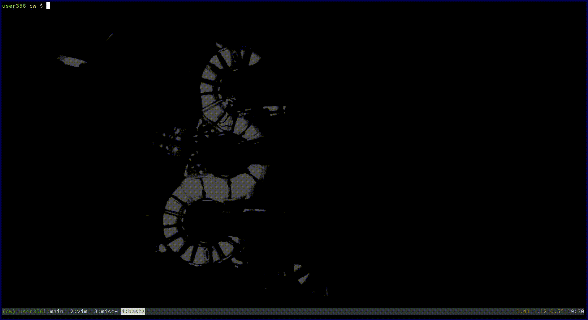

# trepl

A plugin to send code from vim to a REPL in an adjecent tmux pane

## Bindings

```
<space> 	send line
<space> 	send visual selection
<leader>t 	toggle on/off
```

By defualt trepl is enabled. To enable at stratup:

```
let g:trepl_active=1
```

## Demo




## Todo

 - [x] Add binding to enable / disable
 - [x] Send visual seletion
 - [x] Fix sending multiple lines


### Notes

based of replit.vim

